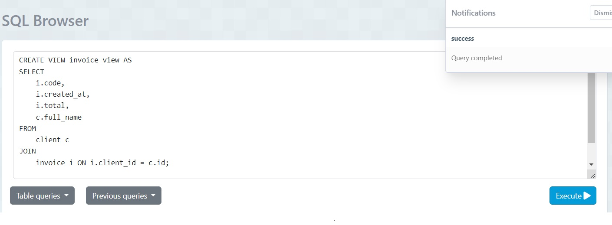
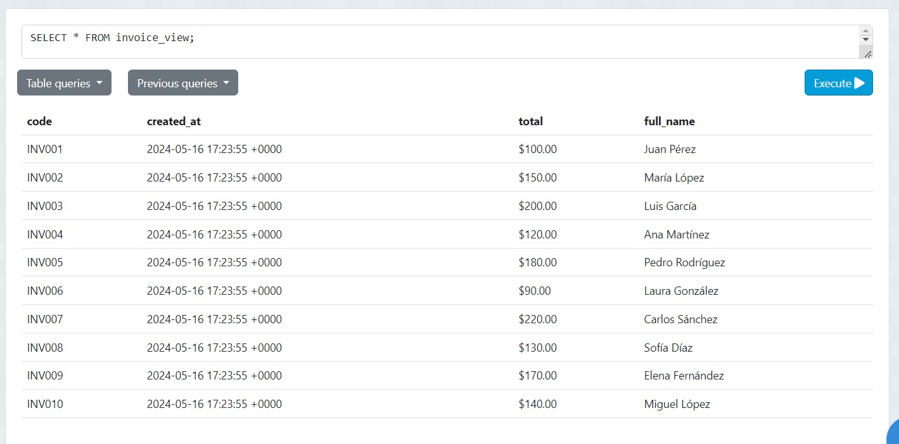
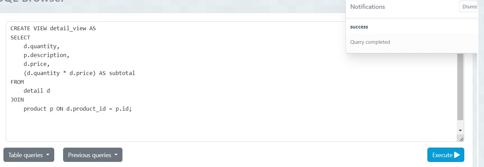
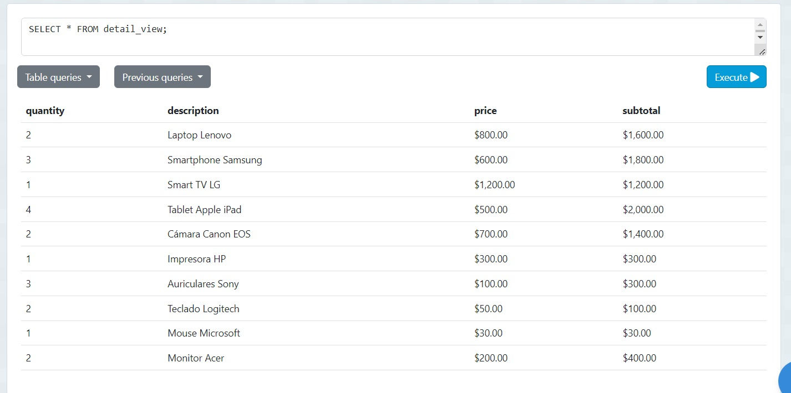

# TAS11 - View-projects
###### Javier Peña

## 1. Creacion del view invoice_view
  - Sentencia:
  ```
  CREATE VIEW invoice_view AS
SELECT 
    i.code,
    i.created_at,
    i.total,
    c.full_name
FROM 
    client c 
JOIN 
    invoice i ON i.client_id = c.id;


  ```
  - Captura:



## 2. Despliege de invoice_view
  ```
 SELECT * FROM invoice_view;
  ```
  - Captura:



## 3. Creacion del view detail_view
  - Sentencia:
  ```
  CREATE VIEW detail_view AS
SELECT 
    d.quantity,
    p.description,
    d.price,
    (d.quantity * d.price) AS subtotal
FROM 
    detail d 
JOIN 
    product p ON d.product_id = p.id;
  ```
  - Captura:



## 4. Despliege de detail_view
  ```
 SELECT * FROM detail_view;


  ```
  - Captura:


